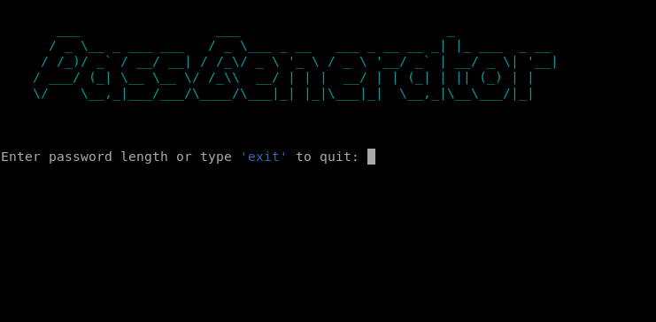

# Password Generator

**This is a simple password generator program written in Python. It generates a random password based on a specified length, **containing a mix of lowercase letters, uppercase letters, numbers, and symbols.**

--------------
# Features

**- Generates a random password with a specified length**
**- Supports lowercase letters, uppercase letters, numbers, and symbols**
**- Uses ANSI escape codes to print colored text art in the terminal**
**- Continuously prompts the user for a password length until "exit" is entered**

--------------
## Requirements

**- Python3** 

--------------
## Usage

**1.** `Clone` or `download` this repository.

**2.** Open a `terminal` and navigate to the `directory` containing the script.

**3.** Run the script with `Python`:

    ```
    python3 generate.py
    ```
**3.1** Or with `Shell` using `chmod +x generate.sh`:

    ```
    bash generate.sh
    ```
**4.** Follow the `on-screen prompts` to generate passwords.

--------------
# Cloning

**You can clone this repository into your terminal:**

    ```
    git clone https://github.com/tkemaz/passgenerator.git
    ```

# Example

**When you run the `script`, you will see the following `prompt`:**


**- Enter a number to specify the length of the password to be generated.**
**- The script will generate a `random password` of the specified length and display it.**
**- To exit the program, type `exit` or press `Ctrl+C`.**

--------------
# License

**This project is licensed under the MIT License.**


